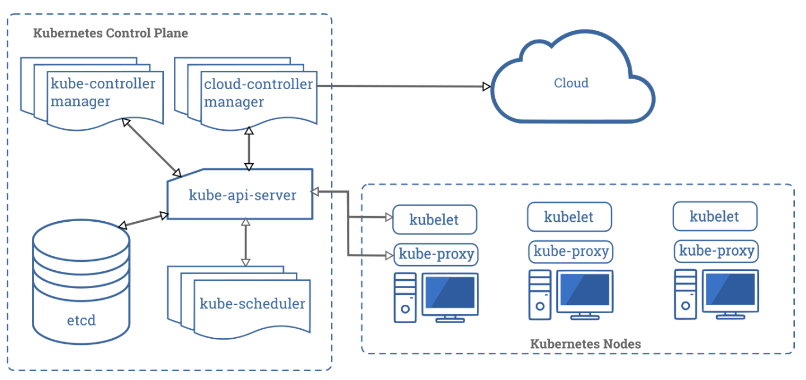

## 架构



## Pod 实现原理

* 什么是 Pod？

````
Pod 的共享上下文包括一组 Linux 名字空间、控制组（cgroup）和可能一些其他的隔离 方面，即用来隔离 Docker 容器的技术。 在 Pod 的上下文中，每个独立的应用可能会进一步实施隔离。
就 Docker 概念的术语而言，Pod 类似于共享名字空间和文件系统卷的一组 Docker 容器。
说明： 除了 Docker 之外，Kubernetes 支持 很多其他容器运行时， Docker 是最有名的运行时， 使用 Docker 的术语来描述 Pod 会很有帮助。
````

* Pod 生命周期

````
和一个个独立的应用容器一样，Pod 也被认为是相对临时性（而不是长期存在）的实体。 Pod 会被创建、赋予一个唯一的 ID（UID）， 并被调度到节点，并在终止（根据重启策略）或删除之前一直运行在该节点。
如果一个节点死掉了，调度到该节点 的 Pod 也被计划在预定超时期限结束后删除。
````

* Pod 网络

````
每个 Pod 都在每个地址族中获得一个唯一的 IP 地址。 Pod 中的每个容器共享网络名字空间，
包括 IP 地址和网络端口。 Pod 内 的容器可以使用 localhost 互相通信。 当 Pod 中的容器与 Pod 之外 的实体通信时，
它们必须协调如何使用共享的网络资源 （例如端口）。
````
