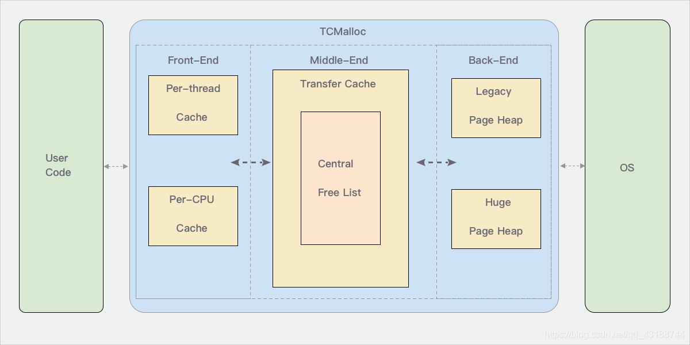

参考url：https://www.cnblogs.com/jiujuan/p/13869547.html

## Page

操作系统对内存管理的单位，TCMalloc也是以页为单位管理内存，但是TCMalloc中Page大小是操作系统中页的倍数关系. TCMalloc的默认Page大小是8KB,Linux是4KB.

## Span

Span是PageHeap中管理内存页的单位，它是由一组连续的Page组成，比如2个Page组成的span，多个这样的span就用链表来管理。当然，还可以有4个Page组成的span等等。

## ThreadCache

ThreadCache是每个线程各自独立拥有的cache，一个cache包含多个空闲内存链表（size classes），每一个链表（size-class）都有自己的object，每个object都是大小相同的。

## CentralCache

CentralCache是当ThreadCache内存不足时，提供内存供其使用。它保持的是空闲块链表，链表数量和ThreadCache数量相同。ThreadCache中内存过多时，可以放回CentralCache中。

## Size-Class

由Span分裂出的对象，由同一个Span分裂出的SizeClass大小相同，SizeClass是对象内存实际的载体.

## PageHeap

PageHeap保存的也是若干链表，不过链表保存的是Span（多个相同的page组成一个Span）。CentralCache内存不足时，可以从PageHeap获取Span，然后把Span切割成object。

## 什么是tcmalloc

thread cache malloc 线程缓存分配

TCMalloc是用来替代传统的malloc内存分配函数。它有减少内存碎片，适用于多核，更好的并行性支持等特性。

* Front-end：
它是一个内存缓存，提供了快速分配和重分配内存给应用的功能。它主要有2部分组成：Per-thread cache 和 Per-CPU cache。

* Middle-end：
职责是给Front-end提供缓存。也就是说当Front-end缓存内存不够用时，从Middle-end申请内存。它主要是 Central free list 这部分内容。

* Back-end：
这一块是负责从操作系统获取内存，并给Middle-end提供缓存使用。它主要涉及 Page Heap 内容。
